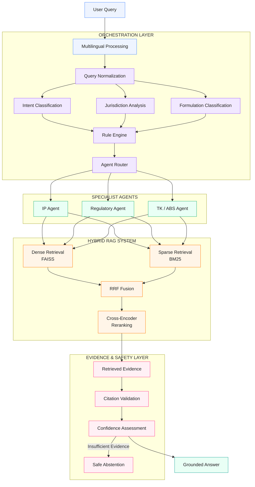

<<<<<<< HEAD

# 🇮🇳 IP-SAKTI Sahayak

### Multilingual, Source-Cited AI Assistant for Intellectual Property & Regulatory Guidance in Ayurveda

[]()
[]()
[]()
[]()
[]()

=======
# 🇮🇳 IP-SAKTI Sahayak

### Multilingual, Source-Cited AI Assistant for Intellectual Property & Regulatory Guidance in Ayurveda

[]()
[]()
[]()
[]()
[]()

>>>>>>> dd3415f (readme.md updated)
> **IP-SAKTI Sahayak** is a multilingual, source-cited AI research assistant designed to provide grounded guidance on Intellectual Property, Ayurveda, Traditional Knowledge, Access & Benefit Sharing (ABS), and regulatory frameworks across Indian and international regimes.

---

## 🏆 Smart India Hackathon 2026

| Field | Details |
|---|---|
| **SIH Code** | `SIH26045` |
| **Problem Statement** | **IP-SAKTI Sahayak** |
| **Category** | Software |
| **Domain** | AI / RAG / Intellectual Property / AYUSH |
| **Core Technology** | Hybrid Retrieval-Augmented Generation |
| **Primary Objective** | Source-grounded IP and regulatory research |

### Problem Statement

> **IP-SAKTI Sahayak — a multilingual, RAG-based (source-cited) AI assistant for Intellectual Property and regulatory guidance in Ayurveda, across national and international regimes.**

---

# 📌 Table of Contents

- [The Problem](#-the-problem)
- [Our Solution](#-our-solution)
- [Why IP-SAKTI Sahayak Is Different](#-why-ip-sakti-sahayak-is-different)
- [Key Features](#-key-features)
- [How the System Works](#-how-the-system-works)
- [System Architecture](#-system-architecture)
- [RAG Pipeline](#-rag-pipeline)
<<<<<<< HEAD
=======
- [Confidence Score](#-confidence-score)
- [Multilingual & Voice Architecture](#-multilingual--voice-architecture)
- [Authentication & Security](#-authentication--security)
>>>>>>> dd3415f (readme.md updated)
- [Research History](#-research-history)
- [Source & Citation System](#-source--citation-system)
- [Project Statistics](#-project-statistics)
- [Technology Stack](#-technology-stack)
- [Repository Structure](#-repository-structure)
- [Deployment Architecture](#-deployment-architecture)
- [Budget & Cost Strategy](#-budget--cost-strategy)
- [Future Upgrades](#-future-upgrades)
- [Limitations](#-limitations)
- [Getting Started](#-getting-started)
- [Team](#-team)
- [License](#-license)

---

# 🔎 The Problem

Researching Intellectual Property and regulatory requirements in Ayurveda is difficult because relevant information is distributed across multiple domains:

- Intellectual Property regulations
- Patents and trademarks
- AYUSH regulations
- Traditional Knowledge
- Access & Benefit Sharing
- Biological resources
- National regulatory frameworks
- International IP frameworks
- Government notifications and official sources

A conventional chatbot can generate a fluent answer, but fluency does not guarantee that the answer is:

- grounded in authoritative sources,
- jurisdiction-aware,
- traceable,
- reproducible,
- or safe when evidence is insufficient.

### The core problem

**Users need research assistance, not just generated text.**

IP-SAKTI Sahayak therefore treats every research query as a retrieval, reasoning, evidence and verification problem.

---

# 💡 Our Solution

## IP-SAKTI Sahayak

IP-SAKTI Sahayak combines:
<<<<<<< HEAD

**Hybrid Retrieval + Multi-Agent Reasoning + Live Research + Citation Validation + Confidence Assessment + Abstention**

into one research workflow.

```text
User Question
      │
      ▼
Language Detection
      │
      ▼
Query Processing
      │
      ▼
┌─────────────────────────────┐
│      HYBRID RETRIEVAL       │
│                             │
│  FAISS      BM25      WEB   │
│    │          │        │    │
└────┼──────────┼────────┼────┘
     │          │        │
     └──────────┼────────┘
                ▼
        RRF Fusion
                │
                ▼
        Cross-Encoder
         Re-ranking
                │
                ▼
       Multi-Agent Layer
    ┌───────────┼───────────┐
    ▼           ▼           ▼
 IP Agent   AYUSH Agent   TK/ABS Agent
    │           │           │
    └───────────┼───────────┘
                ▼
             Gemini
                │
                ▼
       Citation Validation
                │
                ▼
        Confidence Engine
                │
        ┌───────┴────────┐
        ▼                ▼
      ANSWER           ABSTAIN
        │
        ▼
  Cited Research Response
```
=======
>>>>>>> dd3415f (readme.md updated)

**Hybrid Retrieval + Multi-Agent Reasoning + Live Research + Citation Validation + Confidence Assessment + Abstention**

<<<<<<< HEAD
## 🚀 Why IP-SAKTI Sahayak Is Different

A generic AI chatbot is primarily designed for conversation.

**IP-SAKTI Sahayak is designed for evidence-grounded research.**

### 🤖 Generic Chatbot

```text
Question
   ↓
LLM
   ↓
Answer
```

### 🇮🇳 IP-SAKTI Sahayak

```text
Question
   ↓
Language Detection
   ↓
Query Processing
   ↓
Hybrid Retrieval
   ↓
RRF Fusion
   ↓
Evidence Re-ranking
   ↓
Domain Agents
   ↓
LLM Reasoning
   ↓
Citation Validation
   ↓
Confidence Assessment
   ↓
Answer / Abstain
   ↓
Cited Research Response
```

### 📊 Comparison

| Capability | Generic Chatbot | IP-SAKTI Sahayak |
|---|---|---|
| General conversational AI | ✅ | ✅ |
| Domain-specific IP research | ❌ | ✅ |
| Ayurveda regulatory focus | ❌ | ✅ |
| Traditional Knowledge research | ❌ | ✅ |
| Access & Benefit Sharing research | ❌ | ✅ |
| Hybrid retrieval | Usually ❌ | ✅ |
| FAISS semantic retrieval | ❌ | ✅ |
| BM25 keyword retrieval | ❌ | ✅ |
| Reciprocal Rank Fusion | ❌ | ✅ |
| Cross-Encoder re-ranking | ❌ | ✅ |
| Multi-agent reasoning | Usually ❌ | ✅ |
| Live web research | Limited | ✅ |
| Source citations | Inconsistent | Core feature |
| Source metadata | Limited | ✅ |
| Original source links | Limited | ✅ |
| Citation validation | ❌ | ✅ |
| Confidence assessment | Generic | Evidence-based |
| Abstention | Rare | ✅ |
| Research history | Usually limited | ✅ |
| Authenticated user isolation | Varies | ✅ |
| Privacy-focused data isolation | Varies | ✅ |
| Server-side research persistence | Varies | ✅ |
| Browser-only user data dependency | Often used | ❌ |
| Multilingual research | Limited | ✅ |
| Voice interaction | Limited | English / Hindi / Kannada / Telugu|

### 🔑 The Key Difference

> **IP-SAKTI Sahayak is designed as a research system, not simply a conversational interface over an LLM.**

The platform combines **retrieval, ranking, domain-specific reasoning, live research, source validation, confidence assessment, and abstention** into a single research workflow.

# ✨ Key Features

IP-SAKTI Sahayak brings together **hybrid RAG, domain-specific AI, source citation, Bayesian confidence assessment, multilingual interaction, secure authentication, privacy, and persistent research history**.

### 🔎 Hybrid RAG
- **FAISS** — semantic retrieval
- **BM25** — keyword retrieval
- **Live Web Search** — additional evidence
- **RRF** — retrieval fusion
- **Cross-Encoder** — evidence re-ranking

### 🤖 Multi-Agent AI
Specialized agents handle:
- **IP Agent** — Intellectual Property
- **AYUSH Agent** — Ayurveda and AYUSH regulations
- **TK/ABS Agent** — Traditional Knowledge and Access & Benefit Sharing

### 📚 Source-Cited Responses
Responses provide traceable evidence through:
- Source title and authority
- Evidence snippets
- Source type
- Original source links

### 🌐 Live Research
Live web sources can supplement the internal knowledge base and are clearly identified as **🌐 LIVE WEB SOURCE**.

### 📊 Confidence Score

IP-SAKTI Sahayak uses a **Naive Bayesian approach** to estimate the confidence of a generated response from the available evidence.

The Bayesian calculation is based on:

**P(R | E) = [P(E | R) × P(R)] / P(E)**

where:

- **R** = Reliable Answer
- **E** = Available Evidence
- **P(R)** = Prior probability that an answer is reliable
- **P(E | R)** = Probability of observing the evidence when the answer is reliable
- **P(E)** = Probability of observing the evidence

For multiple evidence signals **E₁, E₂, ..., Eₙ**, the **Naive Bayes assumption** treats the evidence signals as conditionally independent:

**P(R | E₁, E₂, ..., Eₙ) ∝ P(R) × ∏ P(Eᵢ | R)**

The resulting posterior probability is normalized to the range:

**0 ≤ P(R | E₁, ..., Eₙ) ≤ 1**

The final confidence percentage is calculated as:

**Confidence Score = P(R | E₁, ..., Eₙ) × 100**

For example, if:

**P(R | E) = 0.87**

then:

> **Confidence: 87%**

#### 🔍 What the Evidence Represents

The confidence engine considers **evidence-related signals produced during the research pipeline**, such as the strength and availability of retrieved evidence and the system's assessment of the generated response.

```text
Retrieved Evidence
       ↓
Evidence Signals
       ↓
Bayesian Confidence Assessment
       ↓
Posterior Probability
       ↓
× 100
       ↓
Confidence: XX%
```

> **Important:** The confidence score represents the system's **evidence-based confidence in its response**. It is not a probability that the legal or regulatory answer is objectively correct, and it does not replace professional legal or regulatory advice.

### 🚫 Abstention
When the available evidence is insufficient, the system can abstain instead of presenting an unsupported response as fact.

### 🌍 Multilingual & Voice

- **Text-based research:** Supports **13 languages**
- **Voice interaction:** Supports **4 languages**
  - Telugu
  - Hindi
  - English
  - Kannada

Text and voice support are handled independently while using the same underlying research workflow.

### 🔐 Authentication, Security & Privacy

- **Supabase Authentication** for secure user identity and session management
- **Email/password authentication** and **Magic Link**
- **Password hashing** is securely handled by the authentication provider
- **Verified sessions** and protected routes
- **Row Level Security (RLS)** to enforce user-level data access in PostgreSQL
- **Backend user isolation** to prevent unauthorized cross-user data access
- **HTTPS/TLS encryption** for data in transit
- **User-specific research history** and persistent data
- **Environment-based secrets** for API keys and sensitive credentials
- **No API keys or passwords stored in source code**

> **Security is enforced across authentication, transport, database access, backend authorization, and secret management.**

### 🗂️ Research History
Authenticated users can persist and restore their previous research sessions through Supabase-backed storage.

### 🖥️ Research Workspace
A dedicated research interface provides:
- Research Question
- Language selection
- Research Process Tracker
- Research Synthesis & Answer
- Confidence
- Grounded Source Evidence
- Research History
- Settings & Support

### ⭐ Core Value Proposition

> **IP-SAKTI Sahayak transforms a research question into an evidence-grounded, source-cited and confidence-assessed response while maintaining secure, authenticated and user-specific research workflows.**

# ⚙️ How the System Works

IP-SAKTI Sahayak is designed as a complete research workflow that takes a user's question and turns it into a structured, traceable research response.

### 1. 📝 Ask a Research Question

The user enters a question related to Intellectual Property, Ayurveda, Traditional Knowledge, ABS, or regulatory requirements.

The user can select the required language and interact with the research workspace.

### 2. 🔍 Research

The platform processes the request and gathers the relevant information required to address the research question.

The **Research Process Tracker** provides visibility into the progress of the research operation.

### 3. 🧠 Synthesize

The gathered information is analyzed and consolidated into a structured research response.

The system is designed to keep the generated response grounded in the evidence available to it.

### 4. 📚 Review the Evidence

The response is accompanied by **Grounded Source Evidence**, allowing the user to inspect the information supporting the generated answer.

Users can view:

- Source title
- Authority
- Evidence snippet
- Source type
- Original source

### 5. 📊 Check Confidence

A confidence value is displayed with the generated response.

This provides an additional indication of how strongly the system's available evidence supports the response.

### 6. 💾 Continue Research

Authenticated users can return to previous research through **Research History**.

Previous research sessions can be restored without requiring the user to start the research process again.

### 7. 🌐 Research Beyond a Single Source

When relevant, the platform can supplement its internal research resources with live web information.

Live sources are explicitly identified so that users can distinguish them from the platform's internal evidence.

---

### 🔄 End-to-End User Journey

```text
Ask
 ↓
Research
 ↓
Synthesize
 ↓
Review Evidence
 ↓
Check Confidence
 ↓
Save & Continue Research
```

> **The result is a research workspace where users can not only receive an answer, but also inspect its supporting evidence, understand the confidence associated with it, and continue their research over time.**

# 🏗️ System Architecture

IP-SAKTI Sahayak follows a layered architecture in which query processing, domain-specific orchestration, specialist agents, retrieval, and evidence safety work together to produce a grounded research response.



## 🔹 Architecture Layers

### 1. Multilingual Input Layer

The system begins with the user's research question and multilingual processing.

### 2. Orchestration Layer

The orchestration layer prepares the query for research by determining:

- **Query Normalization**
- **Intent Classification**
- **Jurisdiction Analysis**
- **Formulation Classification**
- **Rule Engine Processing**
- **Agent Routing**

This layer determines how the research request should be handled before it reaches the specialist agents.

### 3. Specialist Agent Layer

The **Agent Router** directs the research request to the relevant specialist domain:

- **IP Agent**
- **Regulatory Agent**
- **TK / ABS Agent**

This provides domain-specific handling of different research requirements.

### 4. Hybrid RAG Layer

The specialist agents connect to the hybrid retrieval system consisting of:

- **Dense Retrieval — FAISS**
- **Sparse Retrieval — BM25**
- **RRF Fusion**
- **Cross-Encoder Re-ranking**

The retrieval layer produces the evidence that is passed to the downstream safety and validation stages.

### 5. Evidence & Safety Layer

The retrieved evidence passes through:

```text
Retrieved Evidence
       ↓
Citation Validation
       ↓
Confidence Assessment
       ↓
   ┌───┴────┐
   ↓        ↓
Answer   Abstention
```

This layer provides the final evidence and safety checks before a response is returned.

### 6. Final Output

When sufficient evidence is available, the system produces a:

> **Grounded Answer**

When the available evidence is insufficient, the system can follow the **Safe Abstention** path rather than presenting an unsupported response.

### 🔗 Architectural Principle

The architecture separates **query understanding, domain routing, retrieval, evidence validation, and response safety** into distinct layers.

This allows IP-SAKTI Sahayak to function as a structured research system rather than a simple direct question-to-LLM pipeline.
=======
into one research workflow.

```text
User Question
      │
      ▼
Language Detection
      │
      ▼
Query Processing
      │
      ▼
┌─────────────────────────────┐
│      HYBRID RETRIEVAL       │
│                             │
│  FAISS      BM25      WEB   │
│    │          │        │    │
└────┼──────────┼────────┼────┘
     │          │        │
     └──────────┼────────┘
                ▼
        RRF Fusion
                │
                ▼
        Cross-Encoder
         Re-ranking
                │
                ▼
       Multi-Agent Layer
    ┌───────────┼───────────┐
    ▼           ▼           ▼
 IP Agent   AYUSH Agent   TK/ABS Agent
    │           │           │
    └───────────┼───────────┘
                ▼
             Gemini
                │
                ▼
       Citation Validation
                │
                ▼
        Confidence Engine
                │
        ┌───────┴────────┐
        ▼                ▼
      ANSWER           ABSTAIN
        │
        ▼
  Cited Research Response
>>>>>>> dd3415f (readme.md updated)
