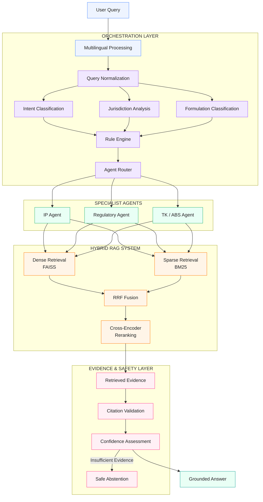

# IP-SAKTI Sahayak

### Multilingual, Source-Cited AI Assistant for Intellectual Property & Regulatory Guidance in Ayurveda

[]()
[]()
[]()
[]()
[]()

---

> **IP-SAKTI Sahayak** is a multilingual, source-cited AI research assistant designed to provide grounded guidance on Intellectual Property, Ayurveda, Traditional Knowledge, Access & Benefit Sharing (ABS), and regulatory frameworks across Indian and international regimes.

---

## 🏆 Smart India Hackathon 2026

| Field | Details |
|---|---|
| **SIH Code** | `SIH26045` |
| **Problem Statement** | **IP-SAKTI Sahayak** |
| **Category** | Software |
| **Domain** | AI / RAG / Intellectual Property / AYUSH |
| **Core Technology** | Hybrid Retrieval-Augmented Generation |
| **Primary Objective** | Source-grounded IP and regulatory research |

### Problem Statement

> **IP-SAKTI Sahayak — a multilingual, RAG-based (source-cited) AI assistant for Intellectual Property and regulatory guidance in Ayurveda, across national and international regimes.**

---

# 📌 Table of Contents

- [The Problem](#-the-problem)
- [Our Solution](#-our-solution)
- [Why IP-SAKTI Sahayak Is Different](#-why-ip-sakti-sahayak-is-different)
- [Key Features](#-key-features)
- [How the System Works](#-how-the-system-works)
- [System Architecture](#-system-architecture)
- [Project Statistics](#-project-statistics)
- [Technology Stack](#-technology-stack)
- [Repository Structure](#-repository-structure)
- [Deployment Architecture](#-deployment-architecture)
- [Budget & Cost Strategy](#-budget--cost-strategy)
- [Future Upgrades](#-future-upgrades)
- [Getting Started](#-getting-started)
- [Team](#-team)
- [License](#-license)

---

# 🔎 The Problem

Researching Intellectual Property and regulatory requirements in Ayurveda is difficult because relevant information is distributed across multiple domains:

- Intellectual Property regulations
- Patents and trademarks
- AYUSH regulations
- Traditional Knowledge
- Access & Benefit Sharing
- Biological resources
- National regulatory frameworks
- International IP frameworks
- Government notifications and official sources

A conventional chatbot can generate a fluent answer, but fluency does not guarantee that the answer is:

- grounded in authoritative sources,
- jurisdiction-aware,
- traceable,
- reproducible,
- or safe when evidence is insufficient.

### The core problem

**Users need research assistance, not just generated text.**

IP-SAKTI Sahayak therefore treats every research query as a retrieval, reasoning, evidence and verification problem.

---

# 💡 Our Solution

## IP-SAKTI Sahayak

IP-SAKTI Sahayak combines:

**Hybrid Retrieval + Multi-Agent Reasoning + Live Research + Citation Validation + Confidence Assessment + Abstention**

into one research workflow.

```text
User Question
      │
      ▼
Language Detection
      │
      ▼
Query Processing
      │
      ▼
┌─────────────────────────────┐
│      HYBRID RETRIEVAL       │
│                             │
│  FAISS      BM25      WEB   │
│    │          │        │    │
└────┼──────────┼────────┼────┘
     │          │        │
     └──────────┼────────┘
                ▼
        RRF Fusion
                │
                ▼
        Cross-Encoder
         Re-ranking
                │
                ▼
       Multi-Agent Layer
    ┌───────────┼───────────┐
    ▼           ▼           ▼
 IP Agent   AYUSH Agent   TK/ABS Agent
    │           │           │
    └───────────┼───────────┘
                ▼
             Gemini
                │
                ▼
       Citation Validation
                │
                ▼
        Confidence Engine
                │
        ┌───────┴────────┐
        ▼                ▼
      ANSWER           ABSTAIN
        │
        ▼
  Cited Research Response
```

## 🚀 Why IP-SAKTI Sahayak Is Different

A generic AI chatbot is primarily designed for conversation.

**IP-SAKTI Sahayak is designed for evidence-grounded research.**

### 🤖 Generic Chatbot

```text
Question
   ↓
LLM
   ↓
Answer
```

### 🇮🇳 IP-SAKTI Sahayak

```text
Question
   ↓
Language Detection
   ↓
Query Processing
   ↓
Hybrid Retrieval
   ↓
RRF Fusion
   ↓
Evidence Re-ranking
   ↓
Domain Agents
   ↓
LLM Reasoning
   ↓
Citation Validation
   ↓
Confidence Assessment
   ↓
Answer / Abstain
   ↓
Cited Research Response
```

### 📊 Comparison

| Capability | Generic Chatbot | IP-SAKTI Sahayak |
|---|---|---|
| General conversational AI | ✅ | ✅ |
| Domain-specific IP research | ❌ | ✅ |
| Ayurveda regulatory focus | ❌ | ✅ |
| Traditional Knowledge research | ❌ | ✅ |
| Access & Benefit Sharing research | ❌ | ✅ |
| Hybrid retrieval | Usually ❌ | ✅ |
| FAISS semantic retrieval | ❌ | ✅ |
| BM25 keyword retrieval | ❌ | ✅ |
| Reciprocal Rank Fusion | ❌ | ✅ |
| Cross-Encoder re-ranking | ❌ | ✅ |
| Multi-agent reasoning | Usually ❌ | ✅ |
| Live web research | Limited | ✅ |
| Source citations | Inconsistent | Core feature |
| Source metadata | Limited | ✅ |
| Original source links | Limited | ✅ |
| Citation validation | ❌ | ✅ |
| Confidence assessment | Generic | Evidence-based |
| Abstention | Rare | ✅ |
| Research history | Usually limited | ✅ |
| Authenticated user isolation | Varies | ✅ |
| Privacy-focused data isolation | Varies | ✅ |
| Server-side research persistence | Varies | ✅ |
| Browser-only user data dependency | Often used | ❌ |
| Multilingual research | Limited | ✅ |
| Voice interaction | Limited | English / Hindi / Kannada / Telugu|

### 🔑 The Key Difference

> **IP-SAKTI Sahayak is designed as a research system, not simply a conversational interface over an LLM.**

The platform combines **retrieval, ranking, domain-specific reasoning, live research, source validation, confidence assessment, and abstention** into a single research workflow.

# ✨ Key Features

IP-SAKTI Sahayak brings together **hybrid RAG, domain-specific AI, source citation, Bayesian confidence assessment, multilingual interaction, secure authentication, privacy, and persistent research history**.

### 🔎 Hybrid RAG
- **FAISS** — semantic retrieval
- **BM25** — keyword retrieval
- **Live Web Search** — additional evidence
- **RRF** — retrieval fusion
- **Cross-Encoder** — evidence re-ranking

### 🤖 Multi-Agent AI
Specialized agents handle:
- **IP Agent** — Intellectual Property
- **AYUSH Agent** — Ayurveda and AYUSH regulations
- **TK/ABS Agent** — Traditional Knowledge and Access & Benefit Sharing

### 📚 Source-Cited Responses
Responses provide traceable evidence through:
- Source title and authority
- Evidence snippets
- Source type
- Original source links

### 🌐 Live Research
Live web sources can supplement the internal knowledge base and are clearly identified as **🌐 LIVE WEB SOURCE**.

### 📊 Confidence Score

IP-SAKTI Sahayak uses a **Naive Bayesian approach** to estimate the confidence of a generated response from the available evidence.

The Bayesian calculation is based on:

**P(R | E) = [P(E | R) × P(R)] / P(E)**

where:

- **R** = Reliable Answer
- **E** = Available Evidence
- **P(R)** = Prior probability that an answer is reliable
- **P(E | R)** = Probability of observing the evidence when the answer is reliable
- **P(E)** = Probability of observing the evidence

For multiple evidence signals **E₁, E₂, ..., Eₙ**, the **Naive Bayes assumption** treats the evidence signals as conditionally independent:

**P(R | E₁, E₂, ..., Eₙ) ∝ P(R) × ∏ P(Eᵢ | R)**

The resulting posterior probability is normalized to the range:

**0 ≤ P(R | E₁, ..., Eₙ) ≤ 1**

The final confidence percentage is calculated as:

**Confidence Score = P(R | E₁, ..., Eₙ) × 100**

For example, if:

**P(R | E) = 0.87**

then:

> **Confidence: 87%**

#### 🔍 What the Evidence Represents

The confidence engine considers **evidence-related signals produced during the research pipeline**, such as the strength and availability of retrieved evidence and the system's assessment of the generated response.

```text
Retrieved Evidence
       ↓
Evidence Signals
       ↓
Bayesian Confidence Assessment
       ↓
Posterior Probability
       ↓
× 100
       ↓
Confidence: XX%
```

> **Important:** The confidence score represents the system's **evidence-based confidence in its response**. It is not a probability that the legal or regulatory answer is objectively correct, and it does not replace professional legal or regulatory advice.

### 🚫 Abstention
When the available evidence is insufficient, the system can abstain instead of presenting an unsupported response as fact.

### 🌍 Multilingual & Voice

- **Text-based research:** Supports **13 languages**
- **Voice interaction:** Supports **4 languages**
  - Telugu
  - Hindi
  - English
  - Kannada

Text and voice support are handled independently while using the same underlying research workflow.

### 🔐 Authentication, Security & Privacy

- **Supabase Authentication** for secure user identity and session management
- **Email/password authentication** and **Magic Link**
- **Password hashing** is securely handled by the authentication provider
- **Verified sessions** and protected routes
- **Row Level Security (RLS)** to enforce user-level data access in PostgreSQL
- **Backend user isolation** to prevent unauthorized cross-user data access
- **HTTPS/TLS encryption** for data in transit
- **User-specific research history** and persistent data
- **Environment-based secrets** for API keys and sensitive credentials
- **No API keys or passwords stored in source code**

> **Security is enforced across authentication, transport, database access, backend authorization, and secret management.**

### 🗂️ Research History
Authenticated users can persist and restore their previous research sessions through Supabase-backed storage.

### 🖥️ Research Workspace
A dedicated research interface provides:
- Research Question
- Language selection
- Research Process Tracker
- Research Synthesis & Answer
- Confidence
- Grounded Source Evidence
- Research History
- Settings & Support

### ⭐ Core Value Proposition

> **IP-SAKTI Sahayak transforms a research question into an evidence-grounded, source-cited and confidence-assessed response while maintaining secure, authenticated and user-specific research workflows.**

# ⚙️ How the System Works

IP-SAKTI Sahayak is designed as a complete research workflow that takes a user's question and turns it into a structured, traceable research response.

### 1. 📝 Ask a Research Question

The user enters a question related to Intellectual Property, Ayurveda, Traditional Knowledge, ABS, or regulatory requirements.

The user can select the required language and interact with the research workspace.

### 2. 🔍 Research

The platform processes the request and gathers the relevant information required to address the research question.

The **Research Process Tracker** provides visibility into the progress of the research operation.

### 3. 🧠 Synthesize

The gathered information is analyzed and consolidated into a structured research response.

The system is designed to keep the generated response grounded in the evidence available to it.

### 4. 📚 Review the Evidence

The response is accompanied by **Grounded Source Evidence**, allowing the user to inspect the information supporting the generated answer.

Users can view:

- Source title
- Authority
- Evidence snippet
- Source type
- Original source

### 5. 📊 Check Confidence

A confidence value is displayed with the generated response.

This provides an additional indication of how strongly the system's available evidence supports the response.

### 6. 💾 Continue Research

Authenticated users can return to previous research through **Research History**.

Previous research sessions can be restored without requiring the user to start the research process again.

### 7. 🌐 Research Beyond a Single Source

When relevant, the platform can supplement its internal research resources with live web information.

Live sources are explicitly identified so that users can distinguish them from the platform's internal evidence.

---

### 🔄 End-to-End User Journey

```text
Ask
 ↓
Research
 ↓
Synthesize
 ↓
Review Evidence
 ↓
Check Confidence
 ↓
Save & Continue Research
```

> **The result is a research workspace where users can not only receive an answer, but also inspect its supporting evidence, understand the confidence associated with it, and continue their research over time.**

---

# 🏗️ System Architecture

IP-SAKTI Sahayak follows a layered architecture in which query processing, domain-specific orchestration, specialist agents, retrieval, and evidence safety work together to produce a grounded research response.



## 🔹 Architecture Layers

### 1. Multilingual Input Layer

The system begins with the user's research question and multilingual processing.

### 2. Orchestration Layer

The orchestration layer prepares the query for research by determining:

- **Query Normalization**
- **Intent Classification**
- **Jurisdiction Analysis**
- **Formulation Classification**
- **Rule Engine Processing**
- **Agent Routing**

This layer determines how the research request should be handled before it reaches the specialist agents.

### 3. Specialist Agent Layer

The **Agent Router** directs the research request to the relevant specialist domain:

- **IP Agent**
- **Regulatory Agent**
- **TK / ABS Agent**

This provides domain-specific handling of different research requirements.

### 4. Hybrid RAG Layer

The specialist agents connect to the hybrid retrieval system consisting of:

- **Dense Retrieval — FAISS**
- **Sparse Retrieval — BM25**
- **RRF Fusion**
- **Cross-Encoder Re-ranking**

The retrieval layer produces the evidence that is passed to the downstream safety and validation stages.

### 5. Evidence & Safety Layer

The retrieved evidence passes through:

```text
Retrieved Evidence
       ↓
Citation Validation
       ↓
Confidence Assessment
       ↓
   ┌───┴────┐
   ↓        ↓
Answer   Abstention
```

This layer provides the final evidence and safety checks before a response is returned.

### 6. Final Output

When sufficient evidence is available, the system produces a:

> **Grounded Answer**

When the available evidence is insufficient, the system can follow the **Safe Abstention** path rather than presenting an unsupported response.

### 🔗 Architectural Principle

The architecture separates **query understanding, domain routing, retrieval, evidence validation, and response safety** into distinct layers.

This allows IP-SAKTI Sahayak to function as a structured research system rather than a simple direct question-to-LLM pipeline.


# 📊 Project Statistics

The following statistics are based on project-level implementation and verification results.

| Metric | Result |
|---|---:|
| **SIH Problem Statement** | `SIH26045` |
| **Supported Text Languages** | 13 |
| **Supported Voice Languages** | 4 |
| **RAG Benchmark Queries** | 20 |
| **Average Query Latency** | 5.98 seconds |
| **Deterministic Test Runs** | 5 consecutive runs |
| **Deterministic Output Consistency** | 100% |
| **Authentication** | Supabase Auth |
| **Research Persistence** | Supabase PostgreSQL |
| **Retrieval Strategy** | FAISS + BM25 + Live Web |
| **Retrieval Fusion** | RRF |
| **Evidence Re-ranking** | Cross-Encoder |
| **Domain Agents** | 3 |
| **Confidence Method** | Naive Bayesian approach |

### 🧪 Verification Highlights

#### RAG Performance

A benchmark consisting of **20 research queries** was used to evaluate the research pipeline.

**Average observed latency: 5.98 seconds per query.**

#### Determinism

The same sample query was executed **five consecutive times** during verification.

The outputs were identical across all five runs:

**100% output consistency**

#### Authentication & Persistence

The platform uses:

- Supabase Authentication
- User-specific session handling
- Supabase PostgreSQL persistence
- Backend user isolation
- Persistent Research History

> **These statistics represent implementation and verification results for the current project version and may change as the platform is further optimized.**


# 🛠️ Technology Stack

| Layer | Technologies |
|---|---|
| **Frontend** | Next.js 16, React, TypeScript |
| **Backend** | FastAPI, Python |
| **Authentication** | Supabase Auth |
| **Database** | Supabase PostgreSQL |
| **Vector Retrieval** | FAISS |
| **Keyword Retrieval** | BM25 |
| **Retrieval Fusion** | Reciprocal Rank Fusion (RRF) |
| **Re-ranking** | Cross-Encoder |
| **LLM** | Gemini |
| **Web Research** | SerpAPI, Tavily, DuckDuckGo fallback |
| **AI / RAG** | Retrieval-Augmented Generation, Multi-Agent Architecture |
| **Voice** | Whisper-based Speech-to-Text, Web Speech / Speech Synthesis |
| **Frontend Deployment** | Vercel |
| **Backend Deployment** | Render |
| **Version Control** | Git, GitHub |

# 📁 Repository Structure

The repository is organized into separate modules for **configuration, data, frontend, backend services, retrieval, orchestration, testing, deployment, and documentation**.

```text
IP-SAKTI/
│
├── config/
│   ├── prompts/
│   ├── rules/
│   ├── confidence.yaml
│   ├── languages.yaml
│   ├── settings.yaml
│   └── sources.json
│
├── data/
│   ├── documents/
│   ├── evaluation/
│   └── knowledge/
│
├── db/
│   └── supabase_schema.sql
│
├── docker/
│
├── docs/
│   └── system-architecture.png
│
├── frontend/
│   ├── public/
│   │
│   ├── src/
│   │   ├── app/
│   │   ├── components/
│   │   ├── context/
│   │   ├── lib/
│   │   │   ├── api.ts
│   │   │   └── voice.ts
│   │   └── proxy.ts
│   │
│   ├── .gitignore
│   ├── AGENTS.md
│   ├── CLAUDE.md
│   ├── next-env.d.ts
│   ├── next.config.ts
│   ├── package.json
│   ├── package-lock.json
│   ├── postcss.config.mjs
│   └── README.md
│
├── indexes/
│
├── ip_sakti/
│   ├── agents/
│   │
│   ├── api/
│   │   ├── __init__.py
│   │   ├── main.py
│   │   └── schemas.py
│   │
│   ├── confidence/
│   │   ├── __init__.py
│   │   └── bayesian_confidence.py
│   │
│   ├── llm/
│   ├── models/
│   ├── multilingual/
│   ├── orchestrator/
│   ├── retrieval/
│   ├── rule_engine/
│   ├── services/
│   ├── ui/
│   ├── utils/
│   │
│   ├── __init__.py
│   ├── knowledge_loader.py
│   ├── pipeline.py
│   └── service.py
│
├── scratch/
│   ├── audit_env_gemini.py
│   ├── audit_sources.py
│   ├── benchmark_scores.py
│   ├── check_api_response.py
│   ├── check_archive_api.py
│   ├── check_html_buttons.py
│   ├── check_kb_urls.py
│   ├── check_streamlit_proc.py
│   ├── check_urls.py
│   ├── debug_query_flow.py
│   ├── debug_supabase_flow.py
│   ├── test_whisper_telugu_prompt.py
│   ├── trace_manu_query.py
│   ├── verify_db_urls.py
│   └── verify_integration.py
│
├── scripts/
│   ├── ingest_kb.py
│   └── test_queries_trace.py
│
├── tests/
│
├── .env.example
├── .gitignore
├── AGENTS.md
├── docker-compose.yml
├── Dockerfile
├── LICENSE
├── pytest.ini
├── README.md
├── requirements.txt
├── test_abstention.py
├── test_e2e.py
├── test_hindi.py
├── test_rag_queries.py
└── test_real_kb.py
```

## 📂 Directory Overview

| Directory | Purpose |
|---|---|
| `config/` | Central configuration for prompts, rules, confidence, languages, application settings and source definitions |
| `data/` | Documents, evaluation resources and knowledge-base data |
| `db/` | Database schema definitions, including the Supabase schema |
| `docker/` | Container and deployment-related resources |
| `docs/` | Project documentation and architecture diagrams |
| `frontend/` | Next.js / React / TypeScript frontend application |
| `indexes/` | Retrieval index artifacts used by the research system |
| `ip_sakti/` | Core Python backend and AI research system |
| `ip_sakti/agents/` | Specialist agent implementations |
| `ip_sakti/api/` | FastAPI endpoints and API schemas |
| `ip_sakti/confidence/` | Bayesian confidence assessment |
| `ip_sakti/llm/` | LLM integration layer |
| `ip_sakti/models/` | Application and AI model components |
| `ip_sakti/multilingual/` | Multilingual processing |
| `ip_sakti/orchestrator/` | Query orchestration and agent coordination |
| `ip_sakti/retrieval/` | Retrieval and RAG components |
| `ip_sakti/rule_engine/` | Rule-based query and workflow processing |
| `ip_sakti/services/` | Supporting backend services |
| `ip_sakti/utils/` | Shared backend utilities |
| `scratch/` | Development audits, debugging and verification utilities |
| `scripts/` | Knowledge ingestion and research/testing scripts |
| `tests/` | Automated project tests |

## 🔑 Core Entry Points

| File | Role |
|---|---|
| `ip_sakti/api/main.py` | FastAPI backend entry point |
| `ip_sakti/pipeline.py` | Core research pipeline |
| `ip_sakti/service.py` | Main backend service layer |
| `ip_sakti/knowledge_loader.py` | Knowledge loading |
| `ip_sakti/confidence/bayesian_confidence.py` | Bayesian confidence calculation |
| `frontend/src/lib/api.ts` | Frontend ↔ backend API communication |
| `frontend/src/lib/voice.ts` | Frontend voice functionality |
| `db/supabase_schema.sql` | Supabase database schema |
| `scripts/ingest_kb.py` | Knowledge-base ingestion |
| `Dockerfile` | Backend container definition |
| `docker-compose.yml` | Container orchestration configuration |
| `requirements.txt` | Python dependencies |
| `frontend/package.json` | Frontend dependencies and scripts |

> **Note:** Generated and environment-specific directories such as `.venv/`, `.next/`, `node_modules/`, `__pycache__/`, `.pytest_cache/`, local environment files, and runtime database artifacts are intentionally omitted from this structure.


# ☁️ Deployment Architecture

IP-SAKTI Sahayak separates the frontend and backend deployment environments while maintaining Supabase as the authentication and persistent data layer.

```text
                         USER
                           │
                           ▼
                ┌───────────────────┐
                │      Vercel       │
                │     Frontend      │
                │     Next.js       │
                └─────────┬─────────┘
                          │
                          │ HTTPS
                          ▼
                ┌───────────────────┐
                │      Render       │
                │   FastAPI Backend │
                └─────────┬─────────┘
                          │
             ┌────────────┼────────────┐
             │            │            │
             ▼            ▼            ▼
        ┌─────────┐  ┌─────────┐  ┌─────────────┐
        │Supabase │  │ Gemini  │  │ Web Research│
        │Auth + DB│  │   LLM   │  │   Sources   │
        └─────────┘  └─────────┘  └─────────────┘
```

### Frontend

The Next.js frontend is deployed through **Vercel**.

It provides:

- User authentication interface
- Research workspace
- Research history
- Source evidence display
- Confidence display
- Settings and support

### Backend

The FastAPI backend is deployed through **Render**.

**Production Backend:**

`https://ip-sakti-jmgy.onrender.com`

**Health Check:**

`https://ip-sakti-jmgy.onrender.com/health`

The health endpoint provides a basic availability check for the deployed backend.

### Supabase

Supabase provides the persistent application infrastructure for:

- Authentication
- PostgreSQL database
- User-specific research data
- Persistent research history

### External AI & Research Services

The backend integrates with external services required for AI reasoning and live research.

```text
Vercel
  │
  ▼
Next.js Frontend
  │
  ▼
Render
  │
  ├── Supabase Auth
  ├── Supabase PostgreSQL
  ├── Gemini
  └── Live Web Research
```

> **Deployment principle:** The frontend, backend, authentication, database, AI services, and external research services are separated into dedicated layers, allowing each component to be managed independently.


# 💰 Budget & Cost Strategy

IP-SAKTI Sahayak is designed around a **cost-conscious cloud architecture**, using managed services where they provide the most value while keeping the core application components lightweight.

### Cost Components

| Component | Service / Approach | Indicative Cost (USD/month) | Indicative Cost (INR/month) |
|---|---|---:|---:|
| **Frontend Hosting** | Vercel Pro | ~$20 | ~₹1,920 |
| **Backend Hosting** | Render | ~$7 | ~₹670 |
| **Authentication + Database** | Supabase Pro | ~$25 | ~₹2,400 |
| **LLM** | Gemini API | ~$5–$20* | ~₹480–₹1,920* |
| **Live Research** | Search APIs / fallback providers | ~$0–$20* | ~₹0–₹1,920* |
| **Vector Retrieval** | FAISS | $0 | ₹0 |
| **Keyword Retrieval** | BM25 | $0 | ₹0 |
| **RAG Pipeline** | Python-based implementation | $0 | ₹0 |
| **Source Code** | GitHub Free | $0 | ₹0 |

### 💵 Indicative Average Cost

For a **small production deployment** with moderate research usage:

**≈ $57–$92 / month**

**≈ ₹5,500–₹8,800 / month**

```text
Small Production Deployment

Infrastructure
      │
      ├── Vercel       ≈ ₹1,920
      ├── Render       ≈ ₹670
      ├── Supabase     ≈ ₹2,400
      │
      └── AI + Search  ≈ ₹480–₹3,840
                         ─────────────
                         ≈ ₹5,500–₹8,800 / month
```

### 🆓 Development / Hackathon Mode

During development and demonstrations, free tiers and open-source components can significantly reduce the cost.

**Indicative development cost:**

**≈ $0–$20 / month**

**≈ ₹0–₹1,920 / month**

### 📈 Scaling

As usage increases, costs will primarily depend on:

- Number of research queries
- LLM token consumption
- Live web-search requests
- Database storage
- Bandwidth
- Document processing volume
- Number of concurrent users

The architecture allows individual components to be scaled independently rather than requiring the entire platform to move to a higher-cost infrastructure tier.

### Cost Optimization Strategy

- Use **FAISS and BM25** as open-source retrieval components.
- Keep retrieval and ranking workloads on the backend.
- Use managed authentication and database infrastructure.
- Use AI and search APIs according to actual demand.
- Keep secrets in environment variables.
- Separate frontend and backend deployment.
- Scale infrastructure progressively with user demand.

> **Note:** These are indicative estimates for budgeting purposes, not fixed quotations. Actual costs vary by provider plan, usage, taxes, exchange rates, AI-token consumption, storage, bandwidth, and search volume. 

# 🚀 Future Upgrades

Future development will extend IP-SAKTI Sahayak toward a **multilingual, knowledge-centric and government-ready research infrastructure**.

### 🇮🇳 1. Sarvam AI & Indic Intelligence

Integration with **Sarvam AI** can strengthen India's regional-language interaction through:

- Indic Speech-to-Text and Text-to-Speech
- Translation and transliteration
- Code-mixed language understanding
- Indian-language document intelligence
- Voice-based government research assistance

### 🧠 2. Knowledge Graph

A domain-specific **Knowledge Graph** can connect:

```text
Traditional Knowledge
        ↓
Plants / Formulations / Entities
        ↓
IP / Patents / Regulations
        ↓
Jurisdiction
        ↓
Authoritative Sources
```

This can enable **multi-hop research, relationship-aware retrieval, contradiction detection and explainable knowledge connections**.

### 🔗 3. Blockchain-Based Provenance

A permissioned blockchain or tamper-evident ledger can strengthen:

- Knowledge provenance
- Evidence integrity
- Document version tracking
- Research audit trails
- Traditional Knowledge and ABS records
- Timestamped source verification

Sensitive documents should remain off-chain, with only required hashes and provenance metadata recorded on-chain.

### 🏛️ 4. Government API Interoperability

Future integration with government API ecosystems such as **API Setu** can enable:

- Government data interoperability
- Regulatory information exchange
- Machine-readable datasets
- Authorized e-governance integrations
- Secure API-based services

### 📚 5. Advanced Knowledge Intelligence

Future versions can introduce:

- Regulatory change detection
- Knowledge-base versioning
- Temporal validity checking
- Jurisdiction-aware reasoning
- Source authority analysis
- Contradiction detection
- Claim-to-source mapping

### 🔐 6. Government-Grade Identity & Security

For institutional deployment:

- Role-Based Access Control (RBAC)
- Department and organization workspaces
- Researcher / Reviewer / Administrator roles
- Single Sign-On (SSO)
- Fine-grained permissions
- Centralized audit logging
- Key rotation and secrets management
- Security monitoring and compliance controls

### 🇮🇳 7. IndiaAI Ecosystem

Future development can explore the **IndiaAI ecosystem** for:

- Indian-language AI models
- Government datasets
- AI compute resources
- Document intelligence
- Model evaluation
- Responsible AI capabilities

### 🗃️ 8. Digital Knowledge Registry

A future **Digital Knowledge Registry** can provide structured records for:

- Traditional Knowledge
- Medicinal plants
- Formulations
- IP records
- Regulatory documents
- Source provenance
- Jurisdiction and applicability

This can create a structured knowledge layer above the existing research system.

### 🎯 Long-Term Vision

```text
                  IP-SAKTI Sahayak
                         │
       ┌─────────────────┼─────────────────┐
       ▼                 ▼                 ▼
  Knowledge Graph   Government APIs    Indic AI
       │                 │                 │
       └─────────────────┼─────────────────┘
                         ▼
                Trusted Knowledge Layer
                         │
          ┌──────────────┼──────────────┐
          ▼              ▼              ▼
      Provenance      Security       Auditability
          │              │              │
          └──────────────┼──────────────┘
                         ▼
              Government-Ready Platform
```

> **Vision:** Evolve IP-SAKTI Sahayak into an India-first, multilingual and auditable knowledge infrastructure connecting **Intellectual Property, Ayurveda, Traditional Knowledge, ABS and regulatory intelligence**.

# 🛠️ Getting Started

## Prerequisites

Make sure the following are installed:

- **Python**
- **Node.js**
- **npm**
- **Git**

You will also need the required credentials and configuration values for the services used by the application.

---

## 1. Clone the Repository

```bash
git clone <YOUR-GITHUB-REPOSITORY-URL>
cd IP-SAKTI
```

---

## 2. Configure Environment Variables

Create the required environment files using the provided examples.

```bash
cp .env.example .env
```

For the frontend, configure the required environment variables according to:

```text
frontend/.env.example
```

> Never commit API keys, passwords, tokens, or other secrets to Git.

---

## 3. Backend Setup

Create and activate a Python virtual environment.

### Windows

```powershell
python -m venv .venv
.venv\Scripts\activate
```

Install the backend dependencies:

```bash
pip install -r requirements.txt
```

Start the FastAPI backend according to the project's configured entry point.

---

## 4. Frontend Setup

Open a new terminal:

```bash
cd frontend
npm install
```

Start the development server:

```bash
npm run dev
```

The frontend development server will be available at the local address displayed by Next.js.

---

## 5. Verify the Backend

The deployed backend provides a health endpoint:

**Production Health Check:**

https://ip-sakti-jmgy.onrender.com/health

A successful response confirms that the deployed API is reachable.

---

## 6. Production Deployment

### 🌐 Live Application

https://ip-sepia-seven.vercel.app

### ⚙️ Backend API

https://ip-sakti-jmgy.onrender.com

### ❤️ Backend Health Check

https://ip-sakti-jmgy.onrender.com/health

---

## 7. Run Tests

From the repository root:

```bash
pytest
```

Build the frontend:

```bash
cd frontend
npm run build
```

> Development and production configuration may require additional environment-specific values depending on the services being used.


# 📄 License

This project is distributed under the license specified in the repository's [`LICENSE`](./LICENSE) file.

Please refer to the `LICENSE` file for the complete terms and conditions governing the use, modification, and distribution of this project.
